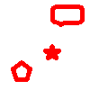

# sic image cli

[](https://github.com/foresterre/sic/actions?query=workflow%3Agithub_actions_ci)
[](https://crates.io/crates/sic)
[](https://docs.rs/sic)
[](https://crates.io/crates/sic)

_Convert images and perform image operations from the command-line._

`sic` (sic image cli) is a front-end for the [image crate](https://github.com/image-rs/image).
Aside from image operations supplied by the image crate, a few additional helpful operations such
as diff, are available. We intend to also support various operations provided by the [imageproc](https://github.com/image-rs/imageproc)
crate in a future release.

### Installation

Install with [cargo](https://crates.io/crates/sic): `cargo install sic`<br>
Update with [cargo](https://crates.io/crates/sic): `cargo install --force sic`

Pre build binary: see [releases](https://github.com/foresterre/sic/releases).

From the source:
- Setup rust and cargo (for example using [rustup](https://rustup.rs/)) <br> 
  Current [MSRV](https://github.com/foresterre/cargo-msrv): 1.35 (edition 2018 is required);
  we aim to always develop against the latest stable release.
- Clone this repo: `git clone https://github.com/foresterre/sic.git`
- Switch to this repo: `cd sic`
- Build a release: `cargo build --release`


### Usage

##### Convert images

Convert an image from one format to another, for example from PNG to JPG.

* Command: `sic --input <input> --output <output>`
* Shorthand: `sic -i <input> -o <output>`
* Example: `sic -i input.png -o output.jpg` <br>

If you want to explicitly set the image output format, you may do so by providing the `--output-format <format>` argument.
Otherwise, sic will attempt to infer the format from the output file extension.

`--help` can be used to view a complete list of supported image output formats. Included are: `bmp`, `farbfeld`, `gif`, `ico`, `jpg` (`jpeg`), `png`, `pam`, `pbm`, `pgm` and `ppm`.
The JPEG quality can optionally be set with `--jpeg-encoding-quality <value>`. The value should be in the range 1-100 (with default 80).
The PNM format (specifically PBM, PGM and PPM) use binary encoding (PNM P4, P5 and P6 respectively) by default.
To use ascii encoding, provide the following flag: `--pnm-encoding-ascii`.

##### Convert or apply operations on a set of images

For the use case where you have a directory containing several (hundreds of) images which you like to convert to different
format, or on which you perhaps want to apply certain image operations, `sic` provides built-in glob pattern matching.
This mode has to be activated separately using the `--mode glob` option (as opposed to the single input, single output
`simple` mode). 

Examples:
* To convert a directory of images from PNG to JPG, you can run sic with the following arguments: <br>
    * `sic --mode glob -i "*.png" -o output_dir --output-format jpg"`
* To convert all images with the `jpg`, `jpeg` and `png` extensions to BMP:
    * `sic --mode glob -i "*.{jpg, jpeg, png}" -o output_dir --output-format bmp`
* To emboss all images in a folder (assuming it contains only supported image files and no folders):
    * `sic --mode glob -i "*" -o embossed_output -f png --filter3x3 -1 -1 0 -1 1 1 0 1 1`

A few things worth noticing: 1) We use quotation marks (`"`) around the input argument, so our shell won't expand the
glob pattern to a list of files. 2) When using glob mode, our output (`-o`) should be a folder instead of a file. 3) We
need to explicitly state the output format with `--output-format`, since we can't infer it from an output extension. 

Output images are placed in the output folder using the directory structure mirrored from the first common directory of
all input files. If output directories do not exist, they will be created. 


<br>

##### Apply image operations

There are two methods to apply image operations. You can only use one at a time.

The first method is called the _script operations method_ (or: _script_), and the second method is
called the _cli operations method_ (or _cli ops_). <br><br>

The operations are applied in the same order as they are provided (left-to-right) and are generally not commutative.


###### 📜 script operations method

Use this method by using the `--apply-operations "<operations>"` (shorthand: `-x`) cli argument and providing
statements which tell `sic` what operations should be applied on the image, for example: <br>
`sic -i input.jpg -o output.jpg --apply-operations "flip-horizontal; blur 10; resize 250 250"` <br>
When more than one image operation is provided, the separator `;` should be used to separate each operation statement. <br><br>

###### ✏️ cli operations method

Use this method by providing cli image operation arguments, such as `--blur` and `--crop`, directly.  
If we use the _cli operations_ method the previously shown example becomes: <br>
`sic -i input.png -o output.jpg --flip-horizontal --blur 10 --resize 250 250` <br>
<br><br>

##### Supported operations

|operations|syntax*|available (from version)|description|
|---|---|---|---|
|blur               | `blur <fp>`                           | Yes (0.5.0) 	    | Performs a Gaussian blur on the image ([more info](https://docs.rs/image/0.19.0/image/imageops/fn.blur.html)). An argument below `0.0`, will use `1.0` instead. |
|brighten           | `brighten <int>`                      | Yes (0.7.0) 	    | Create a brightened version of the image. |
|contrast           | `contrast <fp>`                       | Yes (0.7.0) 	    | Adjust the contrast of the image. |
|crop               | `crop <uint> <uint> <uint> <uint>`    | Yes (0.9.0)       | Syntax: `crop <lx> <ly> <rx> <ry>`, where `lx` is top left corner x pixel coordinate starting at 0, `ly` is the top left corner y pixel coordinate starting at 0, `rx` is the  bottom right corner x pixel coordinate and `ry` is the bottom right corner y pixel coordinate. `rx` and `ry` should be larger than `lx` and `ly` respectively. |
|diff               | `diff <path>`                         | Yes (0.11.0)      | Diff the input image against the argument image to show which pixels are the same (white), different (red) or not part of either image (transparent) |
|filter3x3          | `filter3x3 <args9>`                   | Yes (0.7.0)       | Apply a 3 by 3 convolution filter. |
|flip horizontal    | `flip-horizontal`                     | Yes (0.5.0) 	    | Flips the image on the horizontal axis. |
|flip vertical      | `flip-vertical`                       | Yes (0.5.0) 	    | Flips the image on the vertical axis. |
|gray scale         | `grayscale`                           | Yes (0.7.0) 	    | Transform each pixel to only hold an intensity of light value. Reduces the color space to contain only gray monochromatic values.|
|hue rotate         | `hue-rotate <int>`                    | Yes (0.7.0) 	    | Rotate's the hue, argument is in degrees. Rotates `<int>%360` degrees. |
|invert             | `invert`                              | Yes (0.7.0) 	    | Invert the colours of an image. |
|resize             | `resize <uint> <uint>`                | Yes (0.5.0) 	    | Resize the image to x by y pixels. Can both up- and downscale. Uses a `lanczos3` sampling filter if not overridden. Prior to sic v0.11, the default sampling filter was `gaussian`. |
| >                 | `set resize preserve_aspect_ratio`    | Yes (0.9.0)       | Enables preservation of the aspect ratio when resizing. |
| >                 | `set resize sampling_filter <value>`  | Yes (0.9.0)       | When resizing use the `<value>` sampling filter. Choices are `catmullrom`, `gaussian`,`lanczos3`,`nearest`,`triangle`. |
|rotate90           | `rotate90`                            | Yes (0.7.0) 	    | Rotate an image 90 degrees. |
|rotate180          | `rotate180`                           | Yes (0.7.0) 	    | Rotate an image 180 degrees. |
|rotate270          | `rotate270`                           | Yes (0.7.0) 	    | Rotate an image 270 degrees. |
|unsharpen          | `unsharpen <fp> <int>`                | Yes (0.7.0) 	    | Applies an unsharpen mask to the image. The first parameter defines how much the image should be blurred and the second parameter defines a threshold. If the difference between the original and blurred image is at least the threshold, they will be subtracted from each other. Can be used to sharpen an image. |

`* The exact syntax applies to the --apply-operations method, but can also be used as a reference for the image operations as cli arguments method.`


For some operations, their behaviour can be adapted by setting an operation modifier. These modifiers can be overwritten and they can also be reset (to their default behaviour).

|environment operation|syntax|available (from version)|description|
|---|---|---|---|
|set environment option   | `set <operation> <option-of-operation> [<args 0..n>]` | Yes (0.9.0) | Enables the use of a modifier for an operation. Any operation which uses the value of the modifier will use the set modifier value instead of the default value. Can be overwritten by calling `set` again for the same operation and modifier specifier. |
|unset environment option | `del <operation> <option-of-operation>`               | Yes (0.9.0) | Resets the modifier value. Any operation which looks at the value of this modifier will use the default value instead.|

_legend_:
```
<uint> means any 32 bit unsigned integer is required as argument.
<int> means any 32 bit signed integer is required as argument.
<fp> means any 32 bit floating point number is required as argument.
<value> means a pre defined value. 
<args9> means `<fp> <fp> <fp> <fp> <fp> <fp> <fp> <fp> <fp>`.
<path> means a qualified path to, for example, an image, surrounded by quotation marks (`"`).
```

_Image operation example usage:_

**blur** example: <br>
`sic -i in.png -o out.png --apply-operations "blur 1.3;"` <br>
or <br>
`sic -i in.png -o out.png --blur 1.3`

**brighten** example: <br>
`sic -i in.png -o out.png --apply-operations "brighten 2;"` <br>
or <br>
`sic -i in.png -o out.png --brighten 2`

**contrast** example: <br>
`sic -i in.png -o out.png --apply-operations "contrast 0.7;"` <br>
or <br>
`sic -i in.png -o out.png --contrast 0.7`

**crop** example: <br>
`sic -i in.png -o out.png --apply-operations "crop 0 0 10 10;"` <br>
or <br>
`sic -i in.png -o out.png --crop 0 0 10 10`

**diff** example: <br>
`sic -i a.png -o diff_between_a_and_b.png --apply-operations "diff 'b.png'"` <br>
or <br>
`sic -i a.png -o diff_between_a_and_b.png --diff b.png`

| a                                      | b                                      | output                                                         |
| -------------------------------------- |--------------------------------------- | -------------------------------------------------------------- |
|  |  |  |

**filter3x3** example: <br>
`sic -i in.png -o out.png --apply-operations "filter3x3 -1 -1 0 -1 0 1 0 1 1"` <br>
or <br>
`sic -i in.png -o out.png --filter3x3 -1 -1 0 -1 0 1 0 1 1`

**flip horizontal** example: <br>
`sic -i in.png -o out.png --apply-operations "flip-horizontal"` <br>
or <br>
`sic -i in.png -o out.png --flip-horizontal`

**flip vertical** example: <br>
`sic -i in.png -o out.png --apply-operations "flip-vertical"` <br>
or <br>
`sic -i in.png -o out.png --flip-vertical`

**gray scale** example: <br>
`sic -i in.png -o out.png --apply-operations "grayscale"` <br>
or <br>
`sic -i in.png -o out.png --grayscale`

**hue rotate** example: <br>
`sic -i in.png -o out.png --apply-operations "hue-rotate -90"` <br>
or <br>
`sic -i in.png -o out.png --hue-rotate -90`

**invert** example: <br>
`sic -i in.png -o out.png --apply-operations "invert"` <br>
or <br>
`sic -i in.png -o out.png --invert`

**resize** example: <br>
`sic -i in.png -o out.png --apply-operations "resize 100 100"` <br>
or <br>
`sic -i in.png -o out.png --resize 100 100`

**resize** with **preserve aspect ratio** example: <br>
`sic -i in.png -o out.png --apply-operations "set resize preserve_aspect_ratio; resize 100 100"` <br>
or <br>
`sic -i in.png -o out.png --set-resize-preserve-aspect-ratio true --resize 100 100`

**resize** with **custom sampling filter** (default is 'gaussian') example: <br>
`sic -i in.png -o out.png --apply-operations "set resize sampling_filter triangle; resize 100 100"` <br>
or <br>
`sic -i in.png -o out.png --set-resize-sampling-filter triangle --resize 100 100`

**rotate 90 degree** example: <br>
`sic -i in.png -o out.png --apply-operations "rotate90"` <br>
or <br>
`sic -i in.png -o out.png --rotate90`

**rotate 180 degree** example: <br>
`sic -i in.png -o out.png --apply-operations "rotate180"` <br>
or <br>
`sic -i in.png -o out.png --rotate180`

**rotate 270 degree** example: <br>
`sic -i in.png -o out.png --apply-operations "rotate270"` <br>
or <br>
`sic -i in.png -o out.png --rotate270`

**unsharpen** example: <br>
`sic -i in.png -o out.png --apply-operations "unsharpen -0.7 1"` <br>
or <br>
`sic -i in.png -o out.png --unsharpen -0.7 1`

example with *multiple* image operations which are applied from left-to-right: <br>
`sic -i in.png -o out.png --apply-operations "rotate180; flip-horizontal; set resize sampling_filter nearest; resize 75 80; hue-rotate 75"` <br>
or <br>
`sic -i in.png -o out.png --rotate180 --flip-horizontal --set-resize-sampling-filter nearest --resize 75 80 --hue-rotate 75`


<br>

**Other resources on image operations**

For additional information on available options and flags, run `sic --help`.

### Suggestions, Questions, Bugs

Feel free to open an issue :mailbox_with_mail: if you have a suggestion, a question or found a bug =).

:guitar: :trumpet: :violin: :saxophone:
